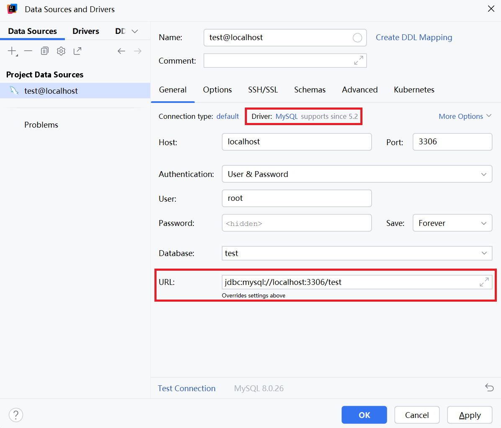
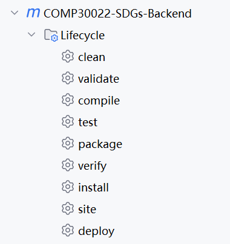

# Spring Boot Backend Project

## Table of Contents

- [Introduction](#introduction)
- [Features](#features)
- [Technologies Used](#technologies-used)
- [Project Structure](#project-structure)
- Getting Started
  - [Prerequisites](#prerequisites)
  - [Installation](#installation)
  - [Running the Application](#running-the-application)
- [API Endpoints](#api-endpoints)
- [Testing](#testing)
- [Future Work](#future-work)

## Introduction

This is a Spring Boot backend project designed to provide various services such as user management, process tracking, community quiz management, and module management. It uses JWT (JSON Web Token) for authentication and implements request handling through global interceptors for security. Pre-compile SQL is used to avoid inject attacks.

## Features

- **User Management**: User registration, login, update, and deletion.
- **Authentication & Authorization**: Secure authentication using JWT.
- **Process Tracking**: Track progress on various modules.
- **Community Quiz**: Create, update, rate, and retrieve community quizzes.
- **Module Management**: Manage different learning modules.

## Technologies Used

- **Spring Boot**: Backend framework
- **JWT**: For user authentication and authorization
- **Spring Data JPA**: For database interaction
- **MySQL**: As the database
- **Lombok**: To reduce boilerplate code
- **JUnit 5**: For unit and integration testing

## Project Structure

```
├── main
│   ├── java/com/chen/itproject
│	│	├── configuration     # configuration for interceptors
│   │   ├── controller        # Controllers for handling HTTP requests
│   │   ├── interceptor       # Interceptors for request handling
│	│	├── mappers           # mappers containing database interaction
│   │   ├── pojo              # entity classes for data models
│   │   ├── services          # Services containing business logic
│   │   ├── util              # Utility classes (e.g., JWT utilities)
│	│	├── ItProjectApplication.java  # entry point for the application
│   └── resources
│       ├── application.yml   # Configuration files
│		├── com/chen/itproject/mappers  #sql xml file for mappers
└── test/java/com/chen/itproject
    ├── UnitTest.java         # Unit test cases
    ├── IntegratedTestIt.java # integrated test cases
```

## Getting Started

### Prerequisites

- Java 11 **only**
- Maven
- MySQL database
- IDE (e.g., IntelliJ IDEA, Eclipse)
- Git

### Installation

1. Clone the repository

2. load the maven pom.xml file

3. Update the `application.yml` file located in `src/main/resources` with your own local database configuration:

   ```
   spring:
       datasource:
           url: jdbc:mysql://localhost:xxxx/xxxx
           username: xxxxx
           password: xxxxx
           driver-class-name: xxxxxxx
   ```



4. run the `console.sql` to initialize the database

### Running the Application

1. Run the application by running the main in the `ItProjectApplication.java`, The application should now be running at:

   ```
   http://localhost:8080
   ```

   .

## API Endpoints

see details in the ***<u>`API document`</u>***

## Testing

### Unit Tests

Unit tests are located in `src/test/java/com/chen/itproject/UnitTest.java`. To run them, use the maven lifecycle "test":



### Integration Testing

Integrated tests are located in `src/test/java/com/chen/itproject/IntegratedTestIt.java`. To run them, use the maven lifecycle "verify". 

Integrated testing is just added to the CICD pipeline for demonstration, but not implemented currently. It will be realized in the sprint 3.

## Future Work

- Complete integration testing.
- Implement global error handler.
- Optimize performance and database queries.
